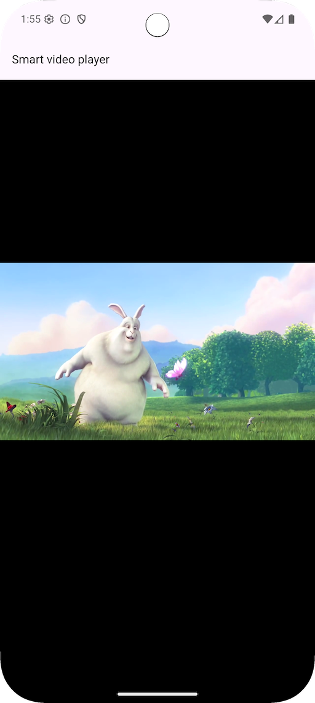

# smart_video_player

A simple video player widget for Flutter applications with enhanced playback controls and features.

## Features

### 1. **Video Source Types**

- Supports three video source types:
    - `asset` (local app bundle)
    - `file` (local file)
    - `network` (URL or network stream)

### 2. **Player Configuration**

- Customize the video display using the `BoxFit` parameter (e.g., `contain`, `cover`, etc.).
- Supports **click-to-play/pause** functionality, which can be enabled or disabled via the
  `clickPlay` parameter.
- Has a `keepAlive` feature to keep the widget alive even when it's not visible.

### 3. **Controller Integration**

- Uses a custom `SmartVideoPlayerController` for controlling playback states, which can either be
  passed externally or internally managed.

### 4. **Audio Session**

- Integrates with `audio_session` for proper audio management, particularly during media playback.

### 5. **Playback Control**

- The player automatically plays and loops the video.
- Playback can be paused or played with a single tap.
- Audio volume can be controlled (range: 0.0 to 1.0).

### 6. **Visibility Detection**

- The video will pause when the widget goes off-screen and resume playing when visible, using the
  `VisibilityDetectorWidget`.

### 7. **UI Elements**

- A loading indicator (`CircularProgressIndicator`) is shown while the video is loading.
- A play button is displayed in the center when the video is paused, which can be tapped to start
  playing.

### 8. **Lifecycle Management**

- Ensures proper initialization and cleanup, including removing listeners when the widget is
  disposed of.

In summary, the `SmartVideoPlayer` is a flexible and interactive video player that supports various
video sources, controls playback, manages audio, and integrates visibility detection for a seamless
user experience.

## Installation

Add the dependency in `pubspec.yaml`:

```yaml 
dependencies:
  smart_video_player: ^1.0.5
```

Then run:

``` bash
flutter pub get
```

## Usage

Please check the example.

## Screenshots





## Example

See the example directory for a complete sample app.

## License

The project is under the MIT license.